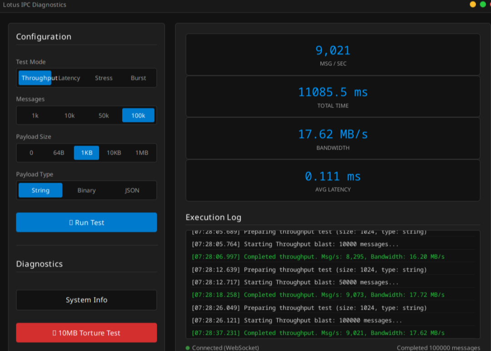

# 🪷 Lotus (lotus-gui)

> ### ⚠️ IMPORTANT
>
> **UPDATED TO USE THE LATEST SERVO EMBEDDINGS 0.1.0!**
>
> We were using 0.0.6 so this is a large jump and allows us better control and ci along with bring in a whole sport of improvements from stability to performance. Please go take a look and give them some love! [Servo 0.1.0 release](https://servo.org/blog/2026/04/13/servo-0.1.0-release/)
>
> **NEW SUPPORT FOR ENCRYPTED APPS with AEAD-ENCRYPTED (AES-256-GCM) VFS**
>
> The latest version adds support for packaging your app in a VFS with a natively derived key. This allows developers to ship closed-source applications while still leveraging web-based frontends. The decryption key is sharded across the native binary and never touches the V8 heap or the Node.js environment.
>
> **Disclaimer about Encryption and Closed-Source Software**
>
> Lotus supports encryption to protect your intellectual property. However, the encryption layer relies on secrets injected during the build process. Anyone with access to the decrypted application in memory (e.g., using debugging tools like WinDbg, Frida, or manual memory inspection) may eventually extract these secrets. Users should be aware that client-side encryption is primarily a deterrent against casual reverse engineering and unauthorized distribution, not a guarantee of absolute security against determined adversaries. As always, security in distributed binaries is a game of making extraction difficult enough that most people won't bother. It is fundamentally impossible to keep assets perfectly secure in the presence of a dedicated reverse engineer.

**Lotus is a high-performance, lightweight desktop GUI framework that pairs the power of Node.js with the speed of the Servo rendering engine.** 

It's designed for developers who want to build cross-platform desktop applications with web technologies (HTML/CSS/JS) and want someting a bit easier to use. By using Servo instead of Chromium and keeping Node.js in the driver's seat for OS integration, Lotus delivers a "blistering fast" experience with a tiny footprint.

---

**🏎️ "LOTUS IS MADE WITH THE IDEOLOGY OF A LOTUS ELISE."**
*"If a part doesn't make it start faster, use less memory, or render pixels, it's gone. No extra suspension. No spare tires. No browser pretending to be an operating system."*

**🥊 THE ARCHITECTURE (Or: Why It's Fast)**
• **Lotus Strategy:** 
  *Node owns the OS. Servo paints the pixels. No magic. No fake sandboxes. No hidden instances listening to how you use each piece of it for telemetry. The Goal here is to just be a renderer and let the devs do everything else directly in node with a blistering fast ipc (tested up to 9k messages per second reliably)*

**🔧 THE ANALOGY THAT EXPLAINS EVERYTHING:**
• **Node.js** is the track.
• **Servo** is the car.
• **IPC** is the steering wheel.
  *"On a track, you don't worry about potholes. You worry about lap times."*

**💡 THE POINT:**
*"Node.js already does OS integration. We just needed a renderer. That's it. That's the whole project."*

---

## 🚀 Quick Start (Usage from NPM)

> **The Easy Way:** working Windows and Linux builds are on npm. You don't need to build from source.

### Option 1: Quick Start (Recommended)

The fastest way to get started is with the CLI:

```bash
npx lotus init my-app
cd my-app
npm install
npx lotus dev
```

### Option 2: Manual Setup

If you prefer to set things up yourself:

```bash
mkdir my-lotus-app && cd my-lotus-app
npm init -y
npm install @lotus-gui/core @lotus-gui/dev
```

> Then see the example code below or check `node_modules/@lotus-gui/core/test_app` for a full reference.

---

## 🚀 Features (The Good Stuff)

*   **Speed that actually matters:**
    *   Cold start to interactive window can get below 400ms on linux
    *   Windows is a litter slower right now as it has to compile ANGLE shaders, i am working on a pr to the servo project to add support for caching this on disk so it doesnt have to compile them every time. should eliminate the slower on windows after first launch
    *   A single window stack (Rust + Node + Servo), even add windows maintains the reliance on the stack, you dont just spin  up a second renderer or instance, its just a second dom that's it. 
    *   Adding a second window costs **~80MB**. We share the renderer.

*   **Hybrid Runtime:**
    *   **Core:** Rust-based Servo engine. It renders HTML/CSS/JS. That's it.
    *   **Controller:** Node.js main thread. It does literally everything else.

*   **Hybrid Mode (File Serving):**
    *   **Custom Protocol:** `lotus-resource://` serves files from disk.
    *   **Why?** I wanted to eliminate the need for a webserver just to serve local files. It's faster and more secure this way though it also allows us to have direct control over the file serving process and protocol for adding encrypted virtual file systems in the future. (coming soon!)
    *   **Security:** Directory jailing. You can't `../../` your way to `/etc/passwd`. Nice try. This will also be further enhanced with the encrypted file systems in the future as you will be chunk loading on the fly in the loader itself or from ram if we load the whole thing in so reaching outside of that is noticiably harder on accident.

*   **Asset Protection (Encrypted VFS):**
    *   **Zero-Trust Architecture:** Want to ship a closed-source app? Lotus uses an AEAD-encrypted (AES-256-GCM) Virtual File System where the decryption key **never touches JavaScript or the V8 heap**. 
    *   **Native Key Sharding:** The CLI shards the master key across compiled Rust constants and native binary sections (ELF/PE). The Rust core autonomously derives the key in protected memory.
    *   **Byte-Limited LRU Cache:** We mitigate decryption overhead with a strict 128MB byte-limited LRU cache. Once an asset is loaded, it's served from memory at blistering speeds without risking an Out-Of-Memory (OOM) panic on heavy media files.

*   **Advanced IPC (The Steering Wheel):**
    *   **WebSocket IPC Server:** We use `tokio` + `axum` on `127.0.0.1:0` with persistent `WebSocket` connections. It works. It's pretty fast and low latency. Yeah i know its a bit overkill but it works and it was fun to implement, though the main reasons are it also gives us blustering fast ipc, at least on my system in my personal testing i was able to get 10k messages per second reliably at an average latency of 0.111 ms in a string message test.  
 
 
 *IPC stress test: 9,000+ messages/second at 0.111ms average latency (Linux)*


*   **Auto-Adapting:** JSON? Binary? Blobs? We don't care. We handle it via WebSockets natively using msgpack to massively decrease the serialization/deserialization overhead and increase performance.
    *   **MsgPack Batching (Pipelines):** We pack small messages together and unleash them in bursts to avoid starving the Winit rendering thread.
    *   **Zero-Copy focused Routing:** It's not fully zero copy as we have to move between stacks but i have tried my best to minimize this as much as possibly and moving it as little as possible. the only time it becomes copy is when it moves stacks but inside themselves they are not. i am looking into ideas of how to see if we can hand them off with a shared memory space between node and servo but.... for now this is a imo beautiful solution that is fast and reliable. 
    *   **`invoke()` / `handle()` (Promise IPC):** The renderer calls `window.lotus.invoke('ch', data)` and gets back a `Promise`. Node registers `ipcMain.handle('ch', async fn)`. No manual reply channels, no leaked listeners, no correlation IDs in your app code. I wanted this as simple as possible so it is easier to just pickup and use, though with the invoke and handle we still have .send and .on for the more advanced users who want more control over the ipc.
    *   **File Drag-and-Drop:** OS-level file drag is intercepted from winit and forwarded to both the renderer (`window.lotus.on('file-drop', ...)`) and Node.js (`win.on('file-drop', ...)`). Zero Servo involvement, pure winit event forwarding so we dont have to have it touch pieces it doesnt have to.

*   **Window State Persistence:**
    *   It remembers where you put the window (if you give it an ID). i know its a basic concept but i wanted to make it clear it does this on its own, you dont have to do anything special other than give it an ID.
    *   Handles maximized state, size, position.
    
*   **Script Injection:**
    *   Execute arbitrary JS in the renderer from the main process. God mode unlocked? Basically i know there are a lot of cases where you will want to inject scripts into the renderer from the main process on startup or dynamically or inject things into the window. This is the proper way to do it, if you run into any weird cases let me know. 

*   **Native Look & Feel:**
    *   **True OS transparency** I have gone through and built out the proper winit 0.30 so we are using the latest and greatest in windowing tech for linux, mac, and windows and is properly using window-vibrancy 0.5 for native os transparncy on windows so you dont have the horrible overhead of trying to use transparnecy that is software and it looks a lot nicer.
    *   **No White Flash:** We paint transparently. Your users won't be blinded by a white box while your JS loads.

*   **Frameless Windows:**
    *   Kill the title bar. Remove the frame. Build whatever you imagine.
    *   **Custom Drag Regions:** Mark any element with `-webkit-app-region: drag` or `data-lotus-drag`. Lotus bridges it to the OS, no JS required.
    *   **Custom Resize Borders:** 8px invisible resize handles on every edge and corner. They just work, i might add a parameter so you can adjust it if people find this is not how they like or want it differently. though if you are using the frame and decorations then this is handled by the os so i cant do much there.
    *   **Cursor-Aware:** Resize cursors show up at the borders. Servo drives all other cursors (grab, pointer, text, etc.) no interference. it properly communicates with the os it is running on to properly trigger and show the right cursor for the right action.

*   **Multi-Window Support:**
    *   Spawn multiple independent windows from a single Node process.
    *   Shared renderer = ~80MB per extra window.

---

## 📦 Monorepo Structure

Lotus is organized as a monorepo with two packages:

```
lotus/
├── packages/
│   ├── lotus-core/          # @lotus-gui/core -- Runtime engine (Servo + Node bindings)
│   │   ├── src/             # Rust source (N-API bindings, window management)
│   │   ├── lotus.js         # High-level JS API (ServoWindow, IpcMain, App)
│   │   ├── index.js         # Native binding loader
│   │   ├── resources/       # IPC bridge scripts, debugger
│   │   └── test_app/        # Example application
│   │
│   └── lotus-dev/           # @lotus-gui/dev -- CLI toolkit for development & packaging
│       ├── bin/lotus.js      # CLI entry point (lotus dev, build, clean)
│       └── lib/templates/    # Installer templates (RPM spec, etc.)
│
├── package.json             # Monorepo root (npm workspaces)
└── README.md                # You are here
```

| Package | npm Name | What It Does |
|---------|----------|--------------|
| [lotus-core](./packages/lotus-core/) | `@lotus-gui/core` | The runtime -- Servo engine, window management, IPC. This is what your app `require()`s. |
| [lotus-dev](./packages/lotus-dev/) | `@lotus-gui/dev` | CLI toolkit -- dev server with hot-reload, build system, DEB/RPM installer packaging. |

---

## 🛠 Platform Support Matrix

| Platform | Arch | Native Binary (`.node`) | Installer Target | Status |
| :--- | :--- | :--- | :--- | :--- |
| **Linux (Debian/Ubuntu)** | x64 | ✅ Verified | `.deb` (Stable) | Ready |
| **Linux (Fedora/RHEL)** | x64 | ✅ Verified | `.rpm` (Stable) | Ready |
| **Linux (openSUSE)** | x64 | 🛠 Testing | Planned | Alpha |
| **Windows** | x64 | ✅ Verified | `.msi` (testing) | Beta *1 |
| **FreeBSD** | x64 | 🛠 Testing | Planned | Alpha |
| **macOS** | arm64 | 🆘 Help Wanted | TBD | On Hold |

*1 **Windows Status:**

  - **What Works:**
    - ✅ **Native Binary:** Pre-built `.node` available on npm
    - ✅ **Build System:** `lotus build` creates `.msi` installers 
    - ✅ **Runtime:** Angle + Servo + Node.js run correctly
    - ✅ **VC++ Redist:** Auto-embedded and installed silently
    - ✅ **Icon Handling:** PNG/JPG → ICO conversion for installers
    - ✅ **PE Header Patching:** No black console window on launch
  
  - **Known Issues:**
    - ⚠️ **Installer Signing:** Not yet implemented (requires EV cert)
    - ⚠️ **NSIS Fallback:** `lotus build --target nsis` still uses old logic

> **Note:**
> *   **Installer Target:** The packaged distribution format (what users download/install)
> *   **Native Binary:** The `.node` file that powers the runtime (what developers `require()`)

---

## � STATUS: ALPHA almost BETA (BUT IT WORKS WELL!)
We have working **Windows** and **Linux** builds available on npm (`@lotus-gui/core@0.3.1`).
Mac support is missing (because their ecosystem needs someone who nows it, please feel free to help!). BSD and SUSE support is planned (because I know the pain points over there, see Roadmap). Right now there are builds for BSD and SUSE so you can use it though it does not have an installer builder for them yet. I plan to add that in future releases.

## ## Version 0.3.1 (Current) 
* **Status:** Beta? I'm not sure what to call it, but it works way better than any alpha ive seen! but hasnt been around long enough to call it stable yet. This is a big release and brings with it support for linux and windows installers for apps built with lotus. This allows you to build apps with lotus and just npx lotus build and it will build the app installer for you for your platform. It is still a bit early so any feedback is appreciated! I plan to be a continued project for a while and I'm excited to see what we can do with it.

### Supported-Installers 
* **Windows:** MSI, EXE
* **Linux:** RPM, DEB, AppImage, Pacman, Flatpak
* **Mac:** None (yet! please feel free to contribute!)

### Supported-Runtime-Platforms
* **Windows:** 10, 11
* **Linux:** Arch, Debian, Fedora, openSUSE, Ubuntu
* **Mac:** None (yet! please feel free to contribute!)

In general linux, bsd, and windows are supported. Mac is not supported because I don't have a mac. I dont know enough about bsd or suse to automate building installers for them yet but it should fully run there and if not please feel free to open an issue and i will do my best to resolve it!

---

## 🎯 Usage (Code Snippets)

### Step 1: Create `lotus.config.json`

This file controls your app's metadata and build settings:

```json
{
    "name": "MyApp",
    "version": "1.0.0",
    "license": "MIT",
    "description": "My desktop app, minus the bloat",
    "main": "main.js",
    "executableName": "my-app",
    "icon": "./assets/icon.png",
    "build": {
        "linux": {
            "wmClass": "my-app",
            "categories": ["Utility"]
        }
    }
}
```

### Step 2: Create `main.js`

```javascript
const { ServoWindow, ipcMain, app } = require('@lotus-gui/core');
const path = require('path');

app.warmup(); // Wake up the engine

const win = new ServoWindow({
    id: 'main-window',
    root: path.join(__dirname, 'ui'),
    index: 'index.html',
    width: 1024,
    height: 768,
    title: "My Lotus App",
    transparent: true,
    visible: false
});

// Show only after first frame -- no white flash, ever
win.once('frame-ready', () => win.show());

// IPC: talk to the webpage
ipcMain.on('hello', (data) => {
    console.log('Renderer says:', data);
    ipcMain.send('reply', { message: 'Hello from Node!' });
});

// Or use invoke() for a clean request/reply pattern
ipcMain.handle('get-time', async () => {
    return { ts: Date.now() };
});
```

### Step 3: Create your UI

```bash
mkdir ui
```

`ui/index.html`:
```html
<!DOCTYPE html>
<html>
<head><title>My App</title></head>
<body style="background: transparent;">
    <div style="background: rgba(0,0,0,0.9); color: white; padding: 2rem; border-radius: 12px;">
        <h1>Hello from Lotus! 🪷</h1>
        <button onclick="window.lotus.send('hello', { from: 'renderer' })">
            Talk to Node.js
        </button>
        <button onclick="getTime()">
            Invoke get-time (Promise)
        </button>
    </div>
    <script>
        window.lotus.on('reply', (data) => {
            console.log('Node says:', data.message);
        });
        async function getTime() {
            const { ts } = await window.lotus.invoke('get-time');
            console.log('Server time:', new Date(ts).toISOString());
        }
    </script>
</body>
</html>
```

### Step 4: Run it

```bash
npx lotus dev main.js
```

---

## ⚙️ `lotus.config.json` Reference

The config file lives in your project root and controls both runtime behavior and build output.

| Field | Type | Required | Description |
|-------|------|----------|-------------|
| `name` | `string` | Yes | Application display name |
| `version` | `string` | Yes | Semver version (e.g., `"1.0.0"`) |
| `license` | `string` | No | SPDX license identifier. Defaults to `"Proprietary"` |
| `description` | `string` | No | Short description (used in package managers) |
| `main` | `string` | No | Entry point file. Falls back to `package.json` `main`, then `index.js` |
| `executableName` | `string` | No | Binary name (e.g., `my-app` → `/usr/bin/my-app`). Defaults to lowercase `name` |
| `icon` | `string` | No | Path to app icon (relative to project root) |
| `author` | `string` | No | Maintainer name for package metadata |
| `homepage` | `string` | No | Project URL |
| `build.linux.wmClass` | `string` | No | Window manager class (taskbar grouping) |
| `build.linux.section` | `string` | No | Package section (default: `"utils"`) |
| `build.linux.categories` | `string[]` | No | Desktop entry categories |

## 🔧 CLI Commands (`@lotus-gui/dev`)

The `@lotus-gui/dev` package provides the `lotus` CLI:

```bash
# Start dev server with hot-reload (watches for changes, auto-restarts)
lotus dev [entry]

# Build a distributable installer (DEB, RPM, MSI, EXE)
lotus build --platform <linux|win32> --target <deb|rpm|msi|exe>

# Build a strictly Closed-Source encrypted application
lotus build --platform win32 --target exe --encrypt

# Clean build artifacts (removes dist/)
lotus clean
```

See the full [@lotus-gui/dev documentation](./packages/lotus-dev/README.md) for details on build output, flags, and project setup.

## 🎯 Advanced Usage (Code Snippets)

### Hybrid Mode: Serving Files

```javascript
const { ServoWindow, app } = require('@lotus-gui/core');

app.warmup(); // Wake up the engine

const win = new ServoWindow({
    root: '/absolute/path/to/ui',  // Jail the renderer here
    index: 'index.html',            // Start here
    width: 1024,
    height: 768,
    title: "My Hybrid Lotus App"
});

// Now serving at lotus-resource://localhost/index.html
```

### 🔒 Closed-Source Apps: The Encrypted VFS
If you are building proprietary software and don't want users simply unzipping your `.exe` to steal your CSS and JavaScript, Lotus has you covered natively.

When you pass the `--encrypt` flag to the build command, Lotus completely skips copying your `ui/` folder. Instead, it packs it into a high-entropy binary blob and injects it directly into the final executable alongside the Node SEA payload. 

Because the architecture relies on native key derivation, initializing the secure VFS requires exactly one line of JavaScript. Your JS never handles the keys, NAPI hooks can't intercept them, and casual reverse engineers hit a brick wall.

**In your `main.js`:**
```javascript
const { ServoWindow, app } = require('@lotus-gui/core');
const path = require('path');

// 1. Initialize the Encrypted VFS natively (Must happen before warmup)
// If the app wasn't built with --encrypt, this safely skips itself.
app.initVfs(); 

// 2. Wake up the engine
app.warmup(); 

const win = new ServoWindow({
    id: 'secure-window',
    root: path.join(__dirname, 'ui'), // Still maps to the VFS internally!
    index: 'index.html',
    width: 1024,
    height: 768
});
```

### IPC: Talking to the Machine
The renderer is a webpage. The main process is Node. They talk and do it pretty well!

**Renderer (The Webpage):**
```javascript
// Fire and forget.
window.lotus.send('channel', { magic: true });

// Binary.
const blob = new Blob(['pure binary fury']);
window.lotus.send('binary-channel', blob);

// Promise-based request/reply -- no manual reply channels needed.
const result = await window.lotus.invoke('get-data', { id: 42 });
console.log(result);
```

**Main Process (Node):**
```javascript
const { ipcMain } = require('@lotus-gui/core');

// Fire-and-forget listener.
ipcMain.on('channel', (data) => {
    console.log('Renderer said:', data);
    ipcMain.send('reply', { status: 'acknowledged' });
});

// Request/reply handler -- pairs with window.lotus.invoke().
ipcMain.handle('get-data', async ({ id }) => {
    return await db.find(id); // returned value auto-sent to renderer
});
```

### Native Transparency: "Ghost Mode"
Want a window that keeps the OS vibe? We bridge OS transparency directly to your CSS.

```javascript
const win = new ServoWindow({
    transparent: true, // The magic switch
    title: "Ghost Window"
});
```

**How it works:**
1.  We set the Servo shell background to `0x00000000` (fully transparent).
2.  We tell the OS to make the window transparent.
3.  **Result:** The window is invisible. The *only* thing visible is what **you** paint.

**In your CSS:**
```css
/* This makes the whole app see-through to the desktop */
body {
    background: transparent; 
}

/* This adds a semi-transparent glass effect */
.container {
    background: rgba(0, 0, 0, 0.8); 
    color: white;
}
```

**The "White Flash" Killer:**
Because the default backbone is transparent, there is **zero white flash** on startup. If your app takes 10ms to load, the user sees their wallpaper for 10ms, not a blinding white rectangle. Helps get rid of the cliche white square a lot of web based gui have when they are loading

### Frameless Windows: "Build Your Own Window"
Tired of the how the title bar, frame and decorations look? Feel free to make your own! Its pretty easy to do and i even made sure to give you the tools to do it!

```javascript
const win = new ServoWindow({
    frameless: true,         // Kill the native frame
    transparent: true,       // Optional: go fully borderless
    title: "My Borderless App"
});
```

Out of the box you get:
- **8px resize borders** on every edge/corner -- just move the mouse to the edge.
- **Drag regions** driven by CSS -- no JS wiring required.

**In your HTML:**
```html
<!-- These two approaches both work -->
<div style="-webkit-app-region: drag; cursor: grab;">Drag me to move the window</div>
<div data-lotus-drag="true">Also works</div>
```

Lotus auto-detects elements with `-webkit-app-region: drag` or `data-lotus-drag` via injected JS and sends their coordinates to Rust. Mouse down on one of those elements → `drag_window()`. Mouse down on the border → `drag_resize_window()`. Everything else → Servo handles it normally.

To exclude an element inside a drag region (like a close button), use `-webkit-app-region: no-drag` or `data-lotus-drag="false"`.

### Window Controls & Lifecycle
Full control over the OS window manager directly from JavaScript. You don't need to write native code to build a custom title bar.

```javascript
// Window manipulation
win.minimize();
win.unminimize();
win.maximize();
win.unmaximize();
win.focus();
win.setMinSize(800, 600); // enforce a minimum, or pass 0,0 to clear
win.setMaxSize(1920, 1080);

// Listen to OS-level events
win.on('moved', ({ x, y }) => console.log('Window moved to', x, y));
win.on('resize', ({ width, height }) => console.log('Resized to', width, height));
win.on('focus', () => console.log('Window gained focus'));
win.on('blur', () => console.log('Window lost focus'));

// File drag-and-drop (OS-level, works everywhere)
win.on('file-hover', ({ path }) => console.log('Hovering:', path));
win.on('file-hover-cancelled', () => console.log('Drag cancelled'));
win.on('file-drop', ({ path }) => console.log('Dropped:', path));

// Renderer-side (same events arrive via window.lotus.on)
// window.lotus.on('file-drop', ({ path }) => showDropOverlay(path));
```

### Multi-Window Support
Creating specific windows? Easy. They share the same renderer instance, so it costs ~80MB per extra window instead of a whole second rendere top to bottom.

```javascript
const win1 = new ServoWindow({ title: "Window 1" });
const win2 = new ServoWindow({ title: "Window 2" });
const win3 = new ServoWindow({ title: "Window 3" });
// All three windows share the same renderer process.
// Efficient.
```

### Window State Persistence: "Total Recall"
By default, windows have the memory span of a goldfish. They forget where they were. If you want them to remember, give them a name. If you want the states to be remembered give a name, other wise do not give it an id and it will always open in the way the code specifies if that is the prefered operation you desire.

```javascript
const win = new ServoWindow({
    id: "main-window", // REQUIRED for state saving
    title: "I Remember Everything",
    restoreState: true // Default is true, obviously
});
```

**The Logic:**
*   **No ID?** We generate a random UUID. New session, new window, default size or size set in the window constructor.
*   **With ID?** We check `~/.config/app-name/window-state.json`. If we've seen "main-window" before, we put it back exactly where you left it.
*   It snaps back to the last known position immediately.

### Building Distributable Packages
When you're ready to ship your application, Lotus uses a highly optimized Node Single Executable Application (SEA) generation pipeline tied directly into [CrabNebula](https://crabnebula.dev) to spit out installer payloads for every OS.

1. Ensure your `lotus.config.json` is properly configured with your app name, author, icon paths, and `resources` arrays for extra assets.

2. Run the build command with your target OS installer format:
   ```bash
   # Linux Formats
   npx lotus build --target appimage
   npx lotus build --target deb
   npx lotus build --target pacman
   
   # Windows Formats
   npx lotus build --target msi --platform win32
   npx lotus build --target exe --platform win32
   ```

Because Lotus relies on native `.node` bindings, you **must build for the OS you are currently on** (e.g., execute `--target exe --platform win32` inside a Windows CI/CD runner to get Windows binaries).

Your app is now a real installed application with a binary in `/usr/bin/` and everything. Just like a grown-up program.

---

## 🏗️ Building from Source (The Waiting Game)

> **Pro Tip:** You don't actually have to build this yourself. Check the **Actions** tab on GitHub. Every commit produces working artifacts for Linux and Windows. Download, unzip, use the time saved to beat that level you've been procrastinating on. (expect npm install support without having to build yourself soon -- you can just grab the `.node` files from the artifacts tab)


## 🛠️ Prerequisites

If you want to run this from source it should build on linux, windows, BSD and SUSE though the processes are not fully verified, i dont know those systems well and i mainly work on linux and use the github actions to do the builds for the other platforms and just grab the artifacts to test on those.... so if you do build anywhere else please let me know how it goes and feel free to send a pr to update the docs to add that build process :D

### Linux (Debian/Ubuntu/Fedora)
This is where development happens. I do all the dev work from here so i sadly only have build instructions for linux, though i have tested the builds on windows and BSD and SUSE and they work fine, i just have my own preferences for linux... and im honestly horrible at dev on windows... though everything is tested over there, this is just for dev of lotus purposes.

*   **Node.js:** v22+. Don't come at me with v14, we legit require it, we are using N-API 4 so anything lower WILL BREAK.
*   **System Libraries:** You need these or things will scream at you.

    **Ubuntu/Debian:**
    ```bash
    sudo apt-get update
    sudo apt-get install libgl1-mesa-dev libssl-dev python3 libfontconfig1-dev

    # Required for building .deb installers with `lotus build`
    sudo apt-get install dpkg-dev fakeroot
    ```

    **Fedora:**
    ```bash
    sudo dnf install mesa-libGL-devel openssl-devel python3 fontconfig-devel

    # Required for building .rpm installers with `lotus build`
    sudo dnf install rpm-build
    ```

    basically you just need to make sure you have libgl1-mesa-dev, libssl-dev, python3, libfontconfig1-dev, dpkg-dev, fakeroot, rpm-build installed and you should be good to go (though obviously dpkg for debian, rpm for fedora, etc.)
> **Note:** We auto-fix the `GLIBC_TUNABLES` static TLS issue. If you see `ERR_DLOPEN_FAILED` and the app restarts itself, that's just Lotus fixing your environment for you. Don't panic. i hope to some day not require this work around but for now it is what it is. not much i can do about it. 

### Windows
*   **Status:** ✅ Verified
*   **NPM:** ✅ Verified - `@lotus-gui/core` includes the pre-built Windows binary.
*   **Build Requirements** reference the github actions for the windows build as it will be a lot better than me trying to explain it, i wont lie, i def asked gemini for help with getting that build script working as im horrible at windows.


## cloning and building

```bash
git clone https://github.com/1jamie/project-lotus.git
cd project-lotus
npm install
```

**Build the Native Addon:**

```bash
cd packages/lotus-core

# Debug Build (Faster compilation, still slowish on first compile but smalle changes are incremental builds so you only rebuild what was changed and no long trimming of the binary or anything)
npm run build:debug

# Release Build (Optimized, takes eons but is much smaller and more optimized)
npm run build
```

**Additional Requirements for Building:**
*   **Rust:** Stable toolchain.
    ```bash
    curl --proto '=https' --tlsv1.2 -sSf https://sh.rustup.rs | sh
    ```
*   **Windows:** Visual Studio Build Tools + `choco install llvm nasm python311`

> **Warning:** The first build takes forever. You are compiling a browser engine and a Node runtime binding. Go make a coffee. Read a book. Learn a new language. (though we all know you are scrolling TikTok or Reddit, we all know you aren't being productive while the compile runs, none of us ever are) It gets faster after the first time. I promise.

## 📂 Project Structure (For the curious)

*   `packages/lotus-core/src/lib.rs` - The Brain. Main Rust entry point. Handles N-API, Event Loop, IPC.
*   `packages/lotus-core/src/window_state.rs` - The Memory. Remembers where you put your windows.
*   `packages/lotus-core/src/platform.rs` - The Politeness. Proper OS integrations.
*   `packages/lotus-core/lotus.js` - The Body. High-level Node.js wrapper (`ServoWindow`, `IpcMain`, `App`).
*   `packages/lotus-core/index.js` - The Glue. Native binding loader.
*   `packages/lotus-core/test_app/` - The Real Demo. Full-featured test app.
*   `packages/lotus-dev/bin/lotus.js` - The Toolbox. CLI for dev, build, and clean commands.
*   `packages/lotus-dev/lib/templates/` - The Factory. Installer templates (RPM spec, etc.).

For detailed API documentation, see:
*   [@lotus-gui/core README](./packages/lotus-core/README.md) -- Full `ServoWindow` API, IPC reference, architecture
*   [@lotus-gui/dev README](./packages/lotus-dev/README.md) -- CLI commands, config reference, build pipeline

## 🤝 Contributing

PRs are welcome. If you break the `winit` or `glutin` version requirements, I will close your PR with extreme prejudice. We need specific embedding traits and I'm already sitting on the edge with winit 0.30.2, don't push me off the edge it has already mentally put me on!

1.  Fork it.
2.  Branch it (`git checkout -b feature/cool-stuff`).
3.  Commit it (`git commit -m 'Added cool stuff'`).
4.  Push it.
5.  PR it.

---
## 🗺️ Roadmap

### v0.4.0: The Future (Community Input Welcome)
*   **Build optimization:** See what we can strip out of the servo build. right now its fully support everything a browser does on the js and html side. so that includes things like VR support and XR support which i would say we probably dont need and probably many other things we can trim out. since its and open source project if someone wants to add them back i want to keep it as simple as a change to the build file to add it back in if they want.
*   **Debugger:** Servo does support remote debugging through firefox. Though right now it is not exposed, i plan to have it exposed but only triggered by the dev package being used and if you use the encrypted VFS for a closed source app it will fully disable it on build for end users in lotus-dev
*   **Open to suggestions:** I'm open to suggestions for the future. If you have an idea, let me know. Right now v0.4.0 is just a rough tenative plan for what I might do in the future.

---
**License:** MIT. Do whatever you want, just don't blame me if your computer achieves sentience and takes flight.

## Pieces of the puzzle

### Servo

[Servo](https://servo.org/) is the high-performance, memory-safe browser engine that makes Lotus possible. Written in Rust and designed for massive parallelism, it provides modern web rendering capabilities without the overhead of a full Chromium instance.

*   **Official Site:** [servo.org](https://servo.org/)
*   **GitHub Repository:** [github.com/servo/servo](https://github.com/servo/servo)


### Node.js

[Node.js](https://nodejs.org/) is a JavaScript runtime built on Chrome's V8 engine, it is the backbone and brain of the operation and has a beauitiful expanse of available libs for anything from notifications to encryption, should be able to handle any and everything servo cant.

*   **Official Site:** [nodejs.org](https://nodejs.org/)
*   **GitHub Repository:** [github.com/nodejs/node](https://github.com/nodejs/node)


### Winit

[Winit](https://github.com/rust-windowing/winit) is a cross-platform window creation and event loop library in Rust. It provides Lotus with native OS windows, raw input events, and hardware-accelerated rendering contexts.

*   **Official Site:** [winit.rs](https://winit.rs/)
*   **GitHub Repository:** [github.com/rust-windowing/winit](https://github.com/rust-windowing/winit)


### crabnebula cargo

### window-vibrancy

[window-vibrancy](https://github.com/tauri-apps/window-vibrancy) is a cross-platform windowing library for Rust that allows for native OS transparency.

*   **GitHub Repository:** [github.com/tauri-apps/window-vibrancy](https://github.com/tauri-apps/window-vibrancy)


**P.S.**

The entire framework core is ~2,500 lines of code. (just the renderer piece to clarify)

If that feels suspiciously light, it's because it is. I didn't try to build an OS inside your OS; I just gave Node a window and cut the fat until there was nothing left but speed.

Electron carries the weight of the world. Lotus just carries the pixels.

Though i want to clarify, this is not an "electron killer" or "electron replacement" or anything like that. This is simply a renderer designed to keep node in the front seat and just push the pixels for you. it doesnt have all the bells and whistles of electron, it doesnt have the same level of support, and it doesnt have the same level of maturity. But it is a good starting point for a lightweight GUI framework for nodejs and i plan to keep making it slimmer and faster over time and even more reliable. its not a good replacement for electron, its just a different approach to the same problem for specific use cases like local apps or apps you have full control over the content or you need blistering fast ipc with extremely low latency and throughput.


**AI DISCLAIMER**

I have used ai in the project for templating, troubleshooting, diving through source code to find the reference i needed to read and learn how worked, and documentation originally while i was rapidly itteratting and have since rewrote the documentation myself now the api is more stable. I have tried my best and spent countless hours and days to ensure that the code is correct and that the documentation is accurate, its not a huge code base so i have touched and worked with every line of code in this repo. I will tell you that this is not some BS "vibe coded" system or project. I have worked in IT, Programming and Engineering for going on 11 years. I spent the last 7 years as a Linux enterprise dev/ Linux systems engineer. I have spent a lot of time designing, testing working and griding my hard hours on this project and ensuring this is not some garbage that a unexpirenced person whipped together without actually knowing and understand the way computers work and how to practice proper programing hygene, testing and safe software lifecyle practices. I know what is where, why what works what way, i decided how each and every piece works, written a large amount of it, i have tested different setups and dependancies like the ipc system. I spent a lot of time researching takio, readind the docs figuring out exactly how to use it with my use case and axum so i can web socket the world of my ipc. I dumped so many hours into learning winit 0.30 (which btw, it is a pain to use by its features and layout are amazing, i do recomend the time to learn the new conventions of 0.30), i have poured over so much of the servo repo trying to get the best pieces integrated as nicely as possible and spent so much time fighting with the windows rendering pipeline. i do understand that there is a lot of worries around it and people vibe coding stuff but this is not "vibe coded", this is hundreads of my hours, nights and nights of deep coffee pots and genuine passion for this project. It was involved in this project but it is not running, planning, testing, integrating, designing or any of that, it was just a tool used to speed up piece here and there. There are way too many moving parts here and i have spent way too much time on this to have it reduced down to that.